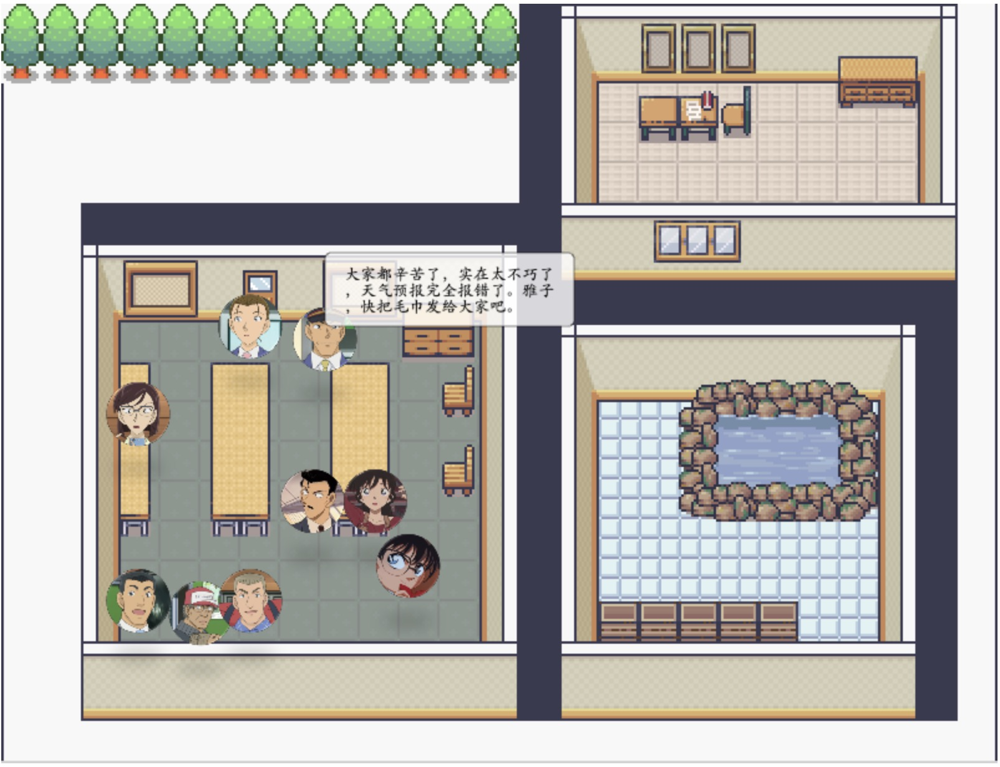

# LLM-based Interactive Drama

This is the official repo for our ACL 2024 paper ([From Role-Play to Drama-Interaction: An LLM Solution](https://aclanthology.org/2024.findings-acl.196.pdf)).


## Demonstration

《候车室里的7个人》 adapted from *Detective Conan*



1. Add your openai key in `openai_key.txt`

```bash
vi openai_key.txt
```

2. Start the backend

```bash
python app.py
```

3. Open the web in the localhost

```bash
python -m http.server 8000
```


**To play**

Every moment, you have two options.

* Stay and see other NPCs' reaction by pressing "Tab" on your keyboard.
* Interact with other NPCs by clicking the avatar of him/her and input the content. Press "Enter" or "确认" to calculate the result based on your input. 

**To the next scene**

Press the "去往下一个场景" button to jump to the next scene.

**See your holdings**

There are some items in the drama. Press the "道具" button to check.


## Todo

